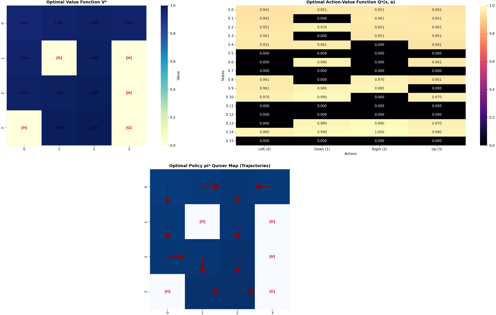
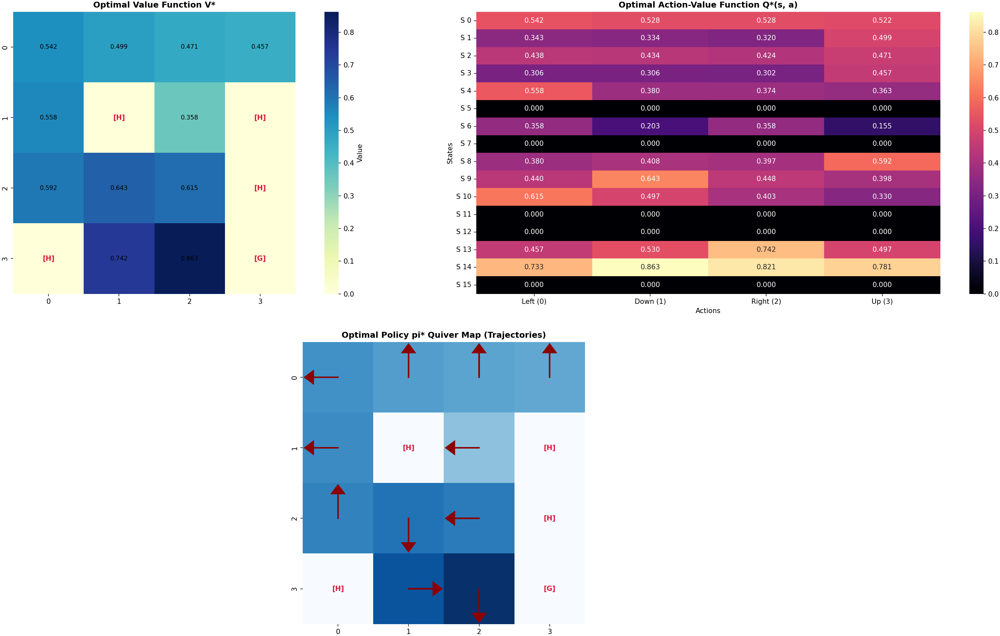

# 🤖 Deep Reinforcement Learning Playground

A comprehensive Python-based playground for exploring and implementing deep reinforcement learning algorithms. This project provides practical implementations of planning, policy-based, and value-based learning agents operating in grid-world environments.

---

## 📋 Table of Contents

- [Setup](#setup)
- [Agents](#agents)
  - [Planning Agent](#planning-agent)
  - [Policy Agent](#policy-agent)
  - [Value Agent](#value-agent)
- [Author](#author)

---

## 🚀 Setup

### Prerequisites
- Python 3.10+
- Conda (recommended)

### Installation

Create and activate the Conda environment:

```bash
conda create -n drl_env python=3.10 -y
conda activate drl_env
```

Install dependencies:

```bash
pip install -r requirements.txt
```

---

## 🤖 Agents

### Planning Agent

The **Planning Agent** computes optimal solutions using complete knowledge of the environment dynamics through methods like value iteration and policy iteration. It provides ground-truth solutions for comparison with learning-based approaches.

#### Running the Planning Agent

```bash
set PYTHONPATH=C:\Users\chris\Desktop\Projects\DeepReinforcementLearning\drl-playground
python scripts/run_planning_agent.py --config configs/planning_agent.yaml
```

#### Results

**Frozen Lake (Non-Slippery)**



**Frozen Lake (Slippery)**



---

### Policy Agent

The **Policy Agent** learns directly from the optimal policy using policy gradient methods and actor-critic approaches.

#### Running the Policy Agent

```bash
set PYTHONPATH=C:\Users\chris\Desktop\Projects\DeepReinforcementLearning\drl-playground
python scripts/run_policy_agent.py --config configs/policy_agent.yaml
```

---

### Value Agent

The **Value Agent** learns state-value or action-value functions using temporal difference learning and Q-learning algorithms.

#### Running the Value Agent

```bash
set PYTHONPATH=C:\Users\chris\Desktop\Projects\DeepReinforcementLearning\drl-playground
python scripts/run_value_agent.py --config configs/value_agent.yaml
```

---

## 👨‍💻 Author

**Christian D'Amata**  
📧 [damatachristian@gmail.com](mailto:damatachristian@gmail.com)